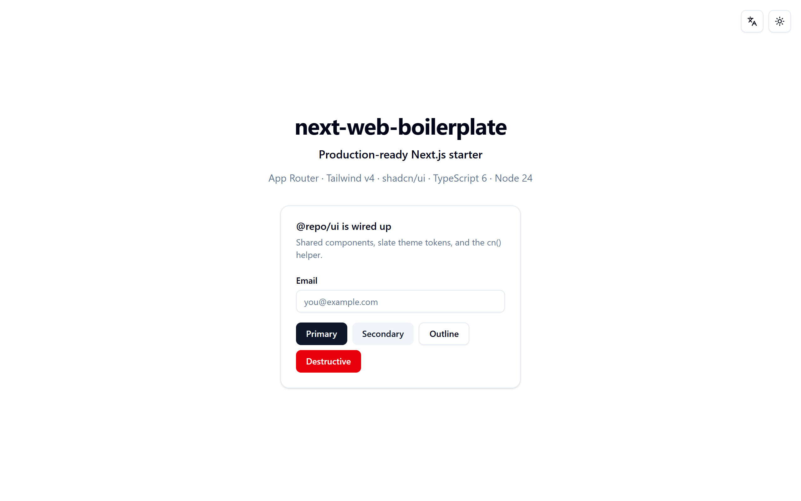
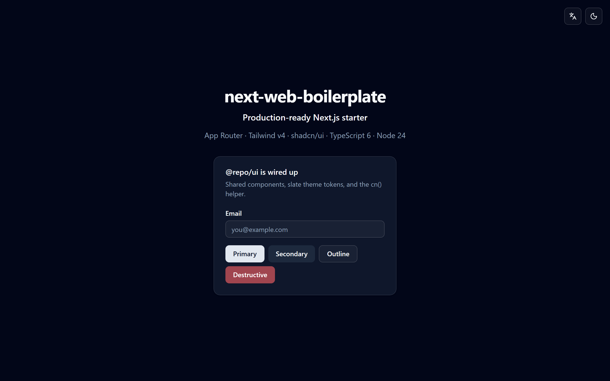
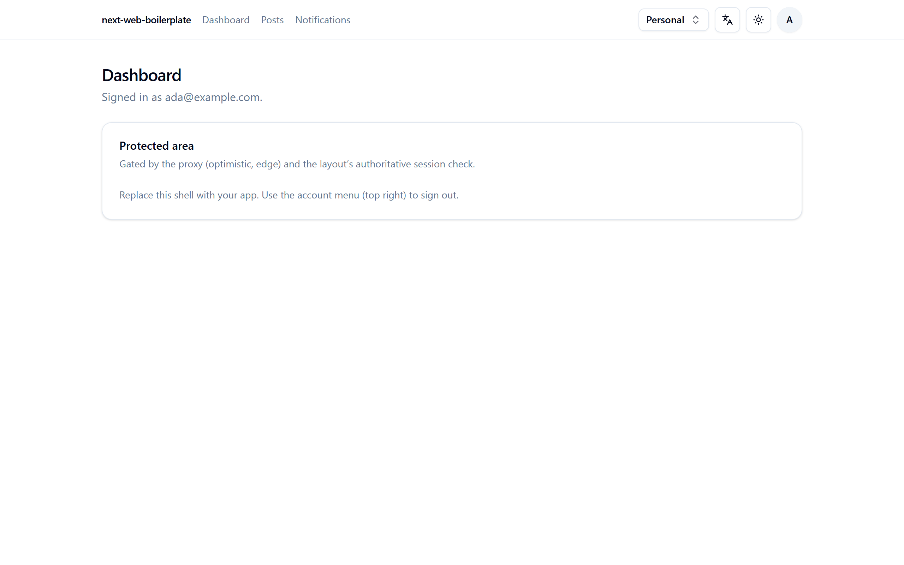
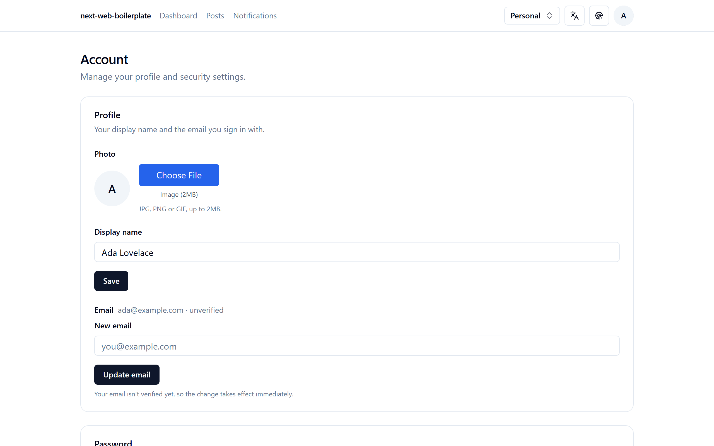

# next-web-boilerplate

[](https://github.com/jrittelmeyer/next-web-boilerplate/actions/workflows/ci.yml)
[](LICENSE)

A production-ready **Next.js 16** monorepo starter for complex web applications.
Every architectural decision is deliberate and documented — clone it, and skip the
first month of wiring up a serious app.

> **Status:** feature-complete and maintained. It boots with **two env vars** (every
> integration degrades gracefully when unconfigured), and every feature — auth with
> 2FA/passkeys/orgs, Stripe, email, uploads, search, jobs, i18n, observability — has
> been **verified end-to-end against real services**, deploy included. What's inside
> and why: [`docs/FEATURES.md`](docs/FEATURES.md). The dated proof:
> [`docs/VERIFICATION.md`](docs/VERIFICATION.md).

## Screenshots

What you get on `git clone` — a themed public landing (light **and** dark) and the
gated app shell — captured from a real keyless run (just the two required env vars,
**no third-party keys**). Dark mode is class-based (`next-themes`, no flash).

<table>
  <tr>
    <td width="50%"><br><sub>Landing · light</sub></td>
    <td width="50%"><br><sub>Landing · dark</sub></td>
  </tr>
  <tr>
    <td width="50%"><br><sub>Signed-in dashboard shell</sub></td>
    <td width="50%"><br><sub>Account · profile &amp; security</sub></td>
  </tr>
</table>

> Browse the shared UI primitives live in the
> [hosted Storybook gallery](https://jrittelmeyer.github.io/next-web-boilerplate/).

## Stack

| Layer | Choice |
| --- | --- |
| Framework / Runtime | Next.js 16 (App Router, React 19) · Node.js 24 LTS |
| Language | TypeScript 6 (`strict`) |
| Monorepo | Turborepo + pnpm workspaces |
| Styling / UI | Tailwind CSS v4 · shadcn/ui (`@repo/ui`) |
| Database | PostgreSQL · Drizzle ORM |
| Auth | Better Auth (email/password + OAuth) |
| API | tRPC (reads) + Server Actions (writes) |
| State / Data | Zustand · TanStack Query v5 |
| Forms / Validation | React Hook Form · Zod (shared via `@repo/validators`) |
| Email | Resend · React Email (`@repo/email`) |
| Payments | Stripe (hosted Checkout + webhooks) |
| Observability | Sentry · BetterStack · PostHog |
| Uploads / Search | Uploadthing · Meilisearch |
| Tooling | Biome + ESLint (Next plugin) · Vitest · Playwright |
| Deployment | Docker (multi-stage, platform-agnostic) |

Full rationale for every choice in [`docs/context/STACK.md`](docs/context/STACK.md).

## Quickstart

**Prerequisites:** Node.js **24+** (see [`.nvmrc`](.nvmrc)), pnpm **11+** (`corepack enable`),
and Docker (for local Postgres).

```bash
cp .env.example .env                                # fill in secrets (DB + auth)
docker compose -f docker/docker-compose.yml up -d   # start Postgres + Meilisearch
pnpm install
pnpm --filter @repo/db db:migrate                   # apply migrations
pnpm dev                                            # http://localhost:3000
```

> On Windows, `cp` isn't a builtin — use `pnpm init-app` (below) or
> `Copy-Item .env.example .env`.

## Use this template

Start a new app from this boilerplate, then run the cross-platform init helper:

```bash
# GitHub: click "Use this template" → clone your new repo, OR grab a history-less copy:
npx degit jrittelmeyer/next-web-boilerplate my-app
cd my-app

pnpm install
pnpm init-app --name my-app   # seeds .env from .env.example, renames the root package
```

`pnpm init-app` is **optional and additive** — it only seeds `.env` (never overwriting
an existing one) and, with `--name`, renames the root `package.json` + README title.
Everything it does you can do by hand; nothing needs to be ripped out. After it runs,
follow the [Quickstart](#quickstart) from `docker compose … up` onward.

Developing with **Claude Code**? After `pnpm install`, hand **`/project-init`** your
idea or your plan documents — the preinstalled
[ai-dev-kit](https://github.com/jrittelmeyer/ai-dev-kit) inception skill runs
discovery (clarifying questions, gap analysis, a competitive
scan, a map of which shipped integrations your product actually needs), writes your
product brief, regenerates the status/backlog docs around *your* app (running
`init-app` for you along the way), and starts the build pipeline.

## Scripts

```bash
pnpm dev          # run all apps in dev
pnpm build        # build everything (Turbo-cached)
pnpm lint         # Biome + ESLint
pnpm type-check   # TypeScript across all packages
pnpm test         # Vitest
pnpm test:e2e     # Playwright
pnpm format       # Biome formatter
pnpm storybook    # @repo/ui component gallery → http://localhost:6006
pnpm clean        # per-package build artifacts (dist/.next) — NOT the Turbo cache
pnpm cache:prune  # evict oldest Turbo-cache entries to the size cap (default 20 GB)
```

> Browse the shared UI primitives online — the
> **[hosted Storybook gallery](https://jrittelmeyer.github.io/next-web-boilerplate/)**,
> republished from `@repo/ui` on every change (no clone or server needed).

## Layout

```text
apps/web/            — the Next.js application (src/ layout)
packages/db/         — Drizzle schema, migrations, client (@repo/db)
packages/auth/       — Better Auth config + session helpers (@repo/auth)
packages/email/      — React Email templates + Resend client (@repo/email)
packages/jobs/       — pg-boss background-jobs worker + enqueue helper (@repo/jobs)
packages/observability/ — BetterStack dashboards-as-code, dev/CI-only (@repo/observability)
packages/ui/         — shadcn/ui shared components (@repo/ui)
packages/validators/ — Zod schemas shared client + server (@repo/validators)
tooling/             — shared eslint / typescript / tailwind configs
docs/                — PROJECT_STATUS + on-demand context docs
docker/              — Dockerfile + docker-compose for local dev
```

## Documentation

| Read this | For |
| --- | --- |
| [`docs/FEATURES.md`](docs/FEATURES.md) | **What's included — and why.** The full inventory with per-choice rationale. |
| [`docs/GETTING_STARTED.md`](docs/GETTING_STARTED.md) | **Using this template.** Clone → run → rename → remove what you don't need → production. |
| [`docs/plain-english-guide/`](docs/plain-english-guide/) | **The zero-jargon tour.** A 12-chapter plain-English explainer (no technical background needed) + a pitch deck — what this is, why each piece was chosen, and how it was built with AI agents. |
| [`AGENTS.md`](AGENTS.md) | **Agent-assisted development.** Onboarding for coding agents (and a great human overview): working agreements + the per-task context-doc index. |
| [`docs/MAINTENANCE.md`](docs/MAINTENANCE.md) | **Keeping it current.** Dependency policy, Renovate, upgrade runbook, watch items. |
| [`docs/context/`](docs/context/) | **Deep dives**, loaded on demand: `STACK`, `ARCHITECTURE`, `CONVENTIONS`, `DATABASE`, `AUTH`, `API`, `STATE`, `UI`, `I18N`, `TESTING`, `SERVICES`, `SECURITY`, `DEPLOYMENT`, `DECISIONS`. |
| [`docs/PROJECT_STATUS.md`](docs/PROJECT_STATUS.md) · [`CHANGELOG.md`](CHANGELOG.md) | What's built + verified, and the release record. |

## Support this project

If this boilerplate saved you time, a ⭐ on the repo helps others find it, and you
can [say thanks via PayPal](https://paypal.me/JohnRittelmeyerDev) (also behind the
repo's Sponsor button). Issues and PRs are just as valuable — see below.

## Contributing

Issues and pull requests are welcome — see [`CONTRIBUTING.md`](CONTRIBUTING.md) for
setup, the quality gate, and conventions, and the [`Code of Conduct`](CODE_OF_CONDUCT.md).
Report security issues privately via the [security policy](.github/SECURITY.md).

## License

[MIT](LICENSE) — use it freely as a starting point for your own projects.
